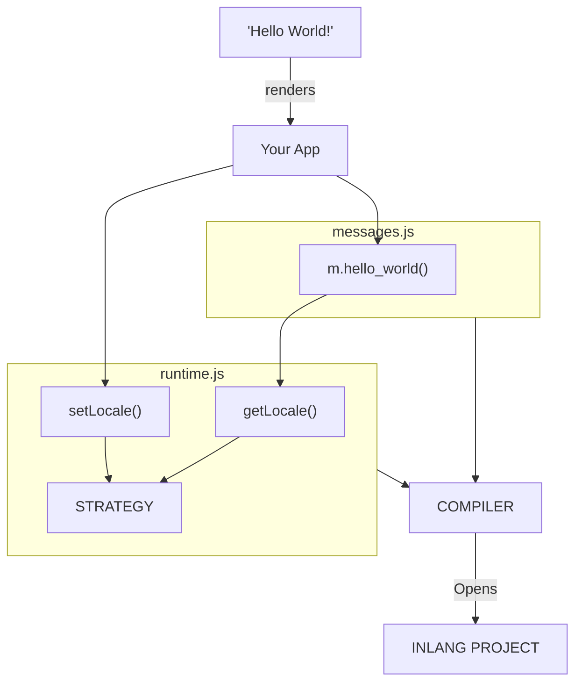

# Architecture

<doc-video src="https://youtu.be/PBhdb5AS0mk"></doc-video>

Paraglide is a compiler-based i18n library. It compiles your translation files into JavaScript functions that you import and call like any other code.

```js
import { m } from "./paraglide/messages.js";

m.greeting({ name: "World" }); // "Hello World!"
```

Because messages are plain functions:

- They work in any framework—React, Vue, Svelte, Node.js, or vanilla JS
- Your bundler handles tree-shaking and code-splitting automatically
- No runtime parsing or framework-specific bindings needed

> [!TIP]
> **Using Vite?** You're in the best position to benefit from Paraglide. Vite's Rollup-based tree-shaking eliminates unused messages automatically, and HMR updates translations instantly. Setup is just [one plugin](./compiling-messages#vite).

## How It Works

1. **Paraglide opens an inlang project** — messages in JSON or any format via [plugins](https://inlang.com/c/plugins)
2. **Compiler generates functions** — one per message, fully typed
3. **You import and call them** — like any other function
4. **Bundler optimizes automatically** — tree-shaking, code-splitting, minification

That's it. No runtime overhead. No framework lock-in.



Paraglide consists of four main parts:

| Part         | File           | Key Exports                                  |
| ------------ | -------------- | -------------------------------------------- |
| **Compiler** | CLI / Plugin   | `compile()`, bundler plugins                 |
| **Messages** | `messages.js`  | `m.hello_world()`, `m.greeting()`, etc.      |
| **Runtime**  | `runtime.js`   | `getLocale()`, `setLocale()`, `locales`      |
| **[Strategy](./strategy)** | `runtime.js`   | `strategy`, `localizeHref()`, `urlPatterns`  |

