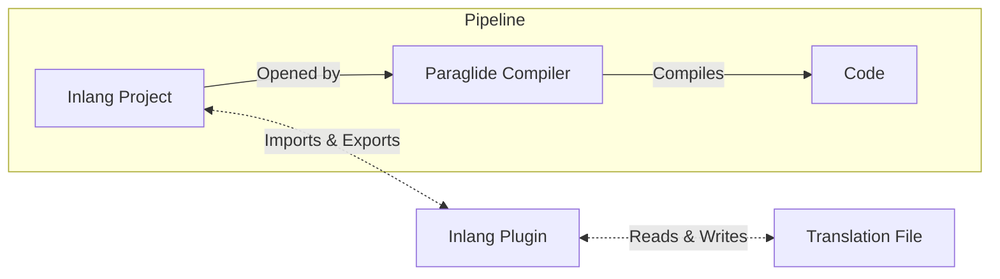

# Message file formats

You can use any message syntax and file formats with Paraglide JS via [inlang plugins](https://inlang.com/c/plugins).

By default, Paraglide JS uses the [inlang-message-format](https://inlang.com/m/reootnfj/plugin-inlang-messageFormat) plugin, but you can use any other plugin that suits your needs. Mixing & matching is also possible.



## Available plugins

All plugins can be found on https://inlang.com/c/plugins. Here are some popular plugins:

- [Inlang Message Format](https://inlang.com/m/reootnfj/plugin-inlang-messageFormat)
- [JSON](https://inlang.com/m/ig84ng0o/plugin-inlang-json)
- [i18next](https://inlang.com/m/3i8bor92/plugin-inlang-i18next)

## Installing a plugin

Add the link of the plugin to the `modules` in the `settings.json` file.

> [!NOTE]
> Refer to the documentation of the plugin for the link and installation guide.

```diff
{
  "baseLocale": "en",
  "locales": ["en", "de"],
  "modules": [
     "other plugins...",
+    "https://cdn.jsdelivr.net/npm/@inlang/plugin-message-format@latest/dist/index.js"
  ]
}
```

## Using multiple plugins

You can use multiple plugins in your project.

```diff
{
  "baseLocale": "en",
  "locales": ["en", "de"],
  "modules": [
     "other plugins...",
+     "https://cdn.jsdelivr.net/npm/@inlang/plugin-message-format@latest/dist/index.js"
+     "https://cdn.jsdelivr.net/npm/@inlang/plugin-i18next@latest/dist/index.js"
  ]
}
```

## Implementation Details

We [learned the hard way](https://opral.substack.com/p/focus-shift-from-inlang-to-lix) that a binary `.inlang` file is needed to make localization simple. Unfortunately, git can't store binary files without losing the benefits of version control.

Hence, for now, unpacking `.inlang` files into directories and creating an in-memory sqlite on each load is the way to go.

## Good-to-know: `.inlang` files

The long-term vision is to use `.inlang` files directly without depending on external message files and plugins.
