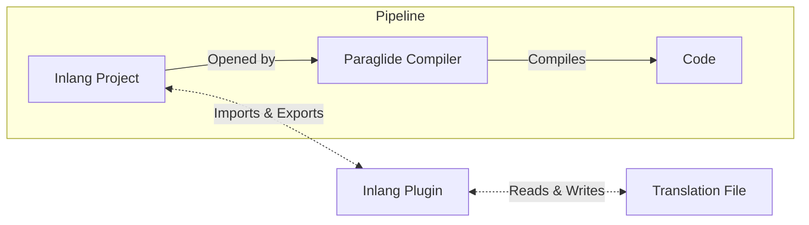

# Translation File Formats

Paraglide JS works with any message syntax and file format via [inlang plugins](https://inlang.com/c/plugins). This means you can use JSON, YAML, i18next format, or any other format that has a plugin.



## Choosing a Plugin

| Plugin                                                                             | Best For                                  | File Format              |
| ---------------------------------------------------------------------------------- | ----------------------------------------- | ------------------------ |
| [Inlang Message Format](https://inlang.com/m/reootnfj/plugin-inlang-messageFormat) | New projects, full inlang feature support | `messages/{locale}.json` |
| [i18next](https://inlang.com/m/3i8bor92/plugin-inlang-i18next)                     | Migrating from i18next                    | `locales/{locale}.json`  |
| [JSON](https://inlang.com/m/ig84ng0o/plugin-inlang-json)                           | Simple key-value translations             | `{locale}.json`          |

Browse all plugins at [inlang.com/c/plugins](https://inlang.com/c/plugins).

## Message Syntax Examples

### Inlang Message Format

`messages/en.json`

```json
{
	"greeting": "Hello {name}!",
	"items_count": "{count, plural, one {# item} other {# items}}",
	"welcome_message": "Welcome to {appName}, {username}!"
}
```

`messages/de.json`

```json
{
	"greeting": "Hallo {name}!",
	"items_count": "{count, plural, one {# Artikel} other {# Artikel}}",
	"welcome_message": "Willkommen bei {appName}, {username}!"
}
```

### i18next Format

`locales/en.json`

```json
{
	"greeting": "Hello {{name}}!",
	"items_count": "{{count}} item",
	"items_count_plural": "{{count}} items"
}
```

### Simple JSON

`en.json`

```json
{
	"greeting": "Hello!",
	"goodbye": "Goodbye!"
}
```

## Installing a Plugin

Add the plugin URL to the `modules` array in your `project.inlang/settings.json`:

> [!NOTE]
> Refer to each plugin's documentation for specific configuration options.

```diff
{
  "baseLocale": "en",
  "locales": ["en", "de"],
  "modules": [
-    "https://cdn.jsdelivr.net/npm/@inlang/plugin-message-format@latest/dist/index.js"
+    "https://cdn.jsdelivr.net/npm/@inlang/plugin-i18next@latest/dist/index.js"
  ]
}
```

## Using Multiple Plugins

You can use multiple plugins to support different file formats in the same project:

```json
{
	"baseLocale": "en",
	"locales": ["en", "de"],
	"modules": [
		"https://cdn.jsdelivr.net/npm/@inlang/plugin-message-format@latest/dist/index.js",
		"https://cdn.jsdelivr.net/npm/@inlang/plugin-i18next@latest/dist/index.js"
	]
}
```

This is useful when migrating from one format to another, or when different parts of your app use different translation formats.
